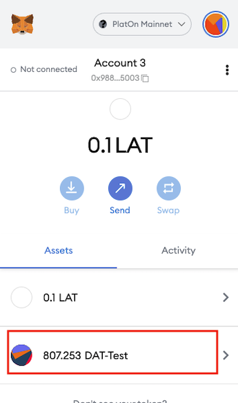

# Metamask shows DAT-Test

## Install metamask plugin in your browser

You can find tutorial [here](https://metamask.io/download/)

## Add PlatON MainNet Network to metamask

You can find tutorial [here](https://forum.latticex.foundation/t/topic/5862)

## Import your private key

  
  

## Import DAT-Test Token

DAT-Test contract address `0x4a23ca00871cf9e40c9214e7c648e9cba6c09729`

  
  

  
  

Now you can see the balance of DAT-Test.
